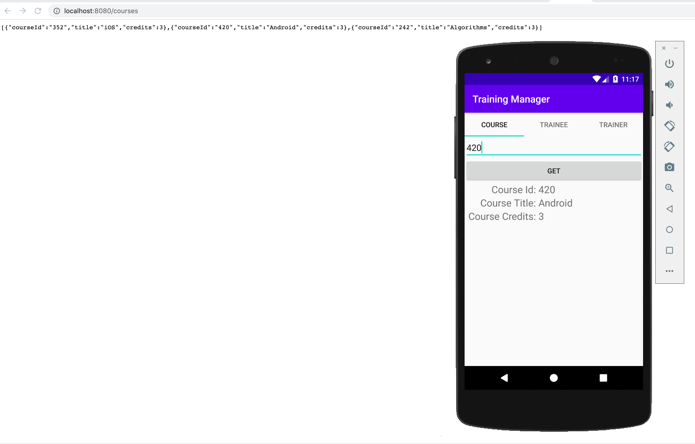

# Java Spring Boot Training Manager App (Backend)

This repository contains the backend component of the Java Spring Boot Training Manager App. The app is designed to provide a REST API for performing CRUD (Create, Read, Update, Delete) operations from the frontend Android application.

## Overview
The Java Spring Boot Training Manager App Backend is built with Java and utilizes the Spring Boot framework. It serves as the backend server for the associated Android application, enabling communication and data management. This API-driven backend allows users to manage training-related data, such as courses, trainers, and participants, through a series of HTTP requests.

## Features
**Create**: Add new courses, trainers, or participants to the database.
**Read**: Retrieve information about courses, trainers, or participants from the database.
**Update**: Modify existing data, such as updating course details or participant information.
**Delete**: Remove courses, trainers, or participants as needed.

## Prerequisites
Before you begin, ensure you have the following installed:

Java Development Kit (JDK)
Maven
Your preferred Integrated Development Environment (IDE)

## Getting Started
1. Clone this repository to your local machine:

```
git clone https://github.com/yourusername/java-spring-boot-training-manager-app-backend.git
```
2. Open the project in your IDE.

3. Build and run the application.

The backend server should be up and running on a specified port (usually 8080 by default).

##  API Endpoints
The following API endpoints are available for interacting with the backend:

`GET /courses`: Get a list of all courses.

`GET /courses/{id}`: Get a specific course by ID.

`POST /courses`: Create a new course.

`PUT /courses/{id}`: Update an existing course.

`DELETE /courses/{id}`: Delete a course.

`GET /trainers`: Get a list of all trainers.

`GET /trainers/{id}`: Get a specific trainer by ID.

`POST /trainers`: Create a new trainer.

`PUT /trainers/{id}`: Update an existing trainer.

`DELETE /trainers/{id}`: Delete a trainer.

`GET /participants`: Get a list of all participants.

`GET /participants/{id`}: Get a specific participant by ID.

`POST /participants`: Create a new participant.

`PUT /participants/{id}`: Update an existing participant.

`DELETE /participants/{id}`: Delete a participant.

##  Database Configuration
The application uses a database to store training-related data. You will need to configure the database connection properties in the application.properties file.
 
 
